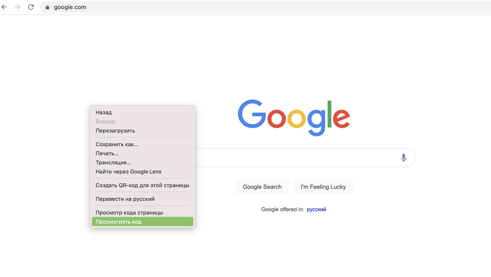
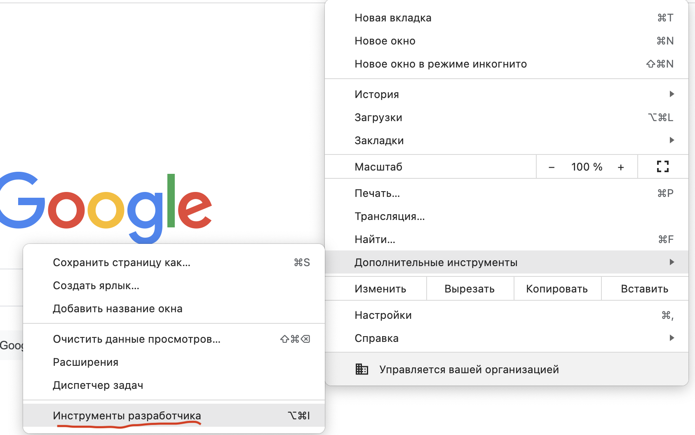
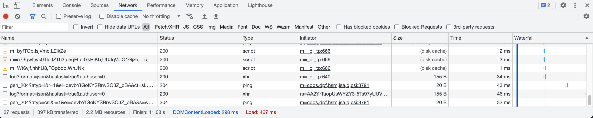
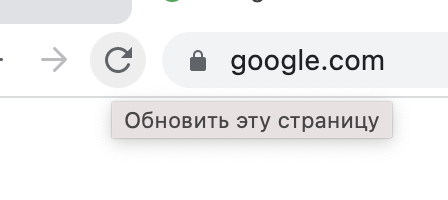
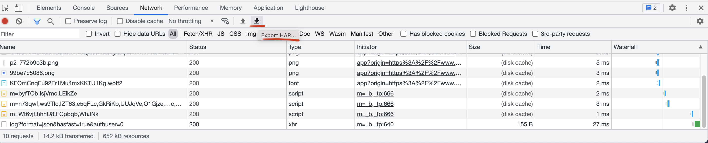

# Как отправить логи сетевых запросов из браузера Google Chrome в поддержку?

1. Открываем страницу логи с которой нам нужны.

2. Окрываем инструменты разработчика. Это можно сделать одним из способов:
 - нажать F12
 - кликнуть на свободном месте правой кнопкой мыши и выбрать **Посмотреть код** из выпадающего меню.

 - Выбрав Дополнительные инструменты > Инструменты разработчика из меню.

 

3. Переходим во вкладку **Сеть** (или в английской версии **Network**).

4. Обновляем страницу. Для этого жмем F5 или кнопку Обновить страницу со стрелочкой наверху справа.

5. Проделываем все необходимые действия для воспроизведения ошибки.

6. Нажимаем кнопку **Экспортировать HAR** (**Export HAR**).

7. Сохраняем файл.

8. Передаем этот файл в поддержку любым удобным способом.
